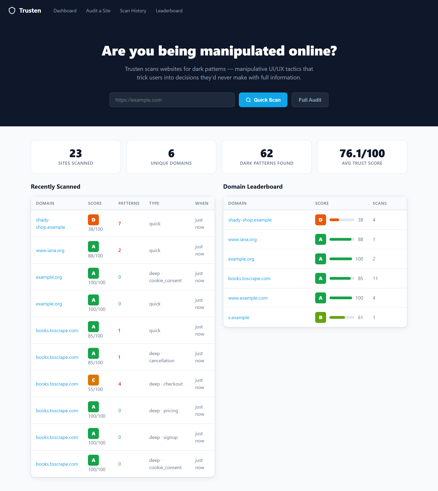
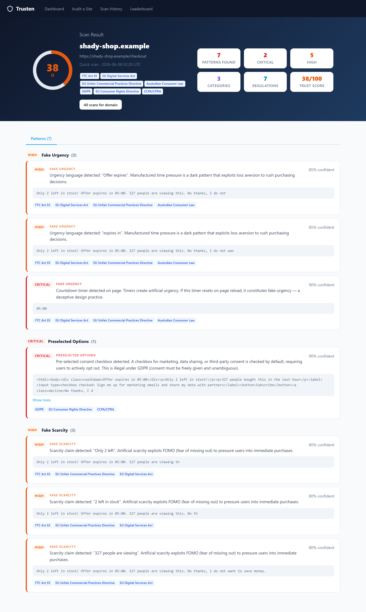
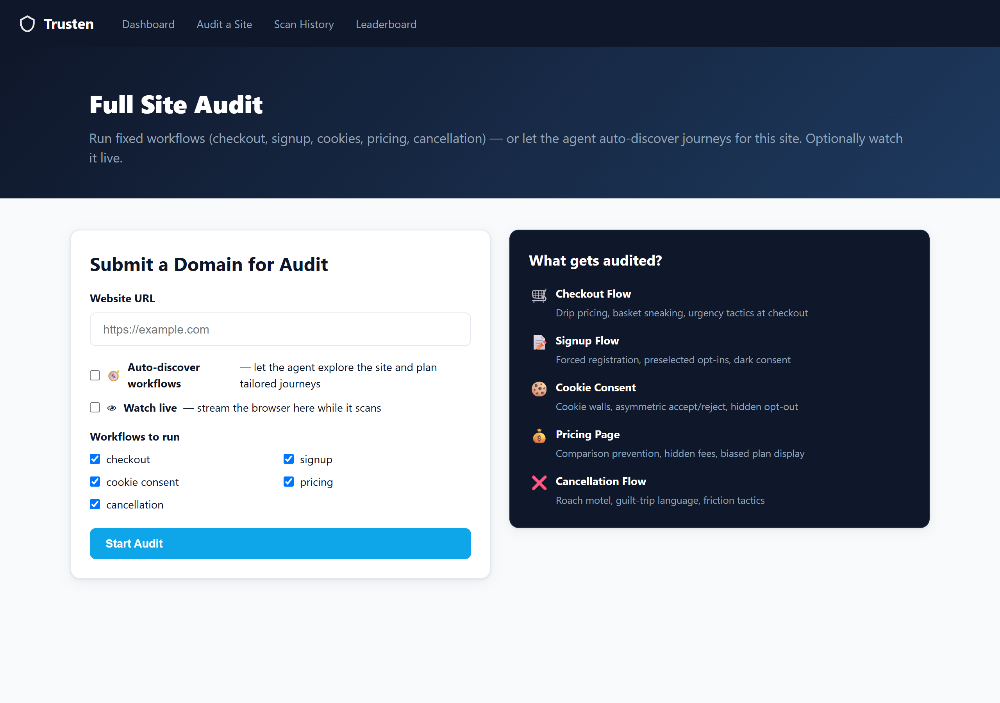
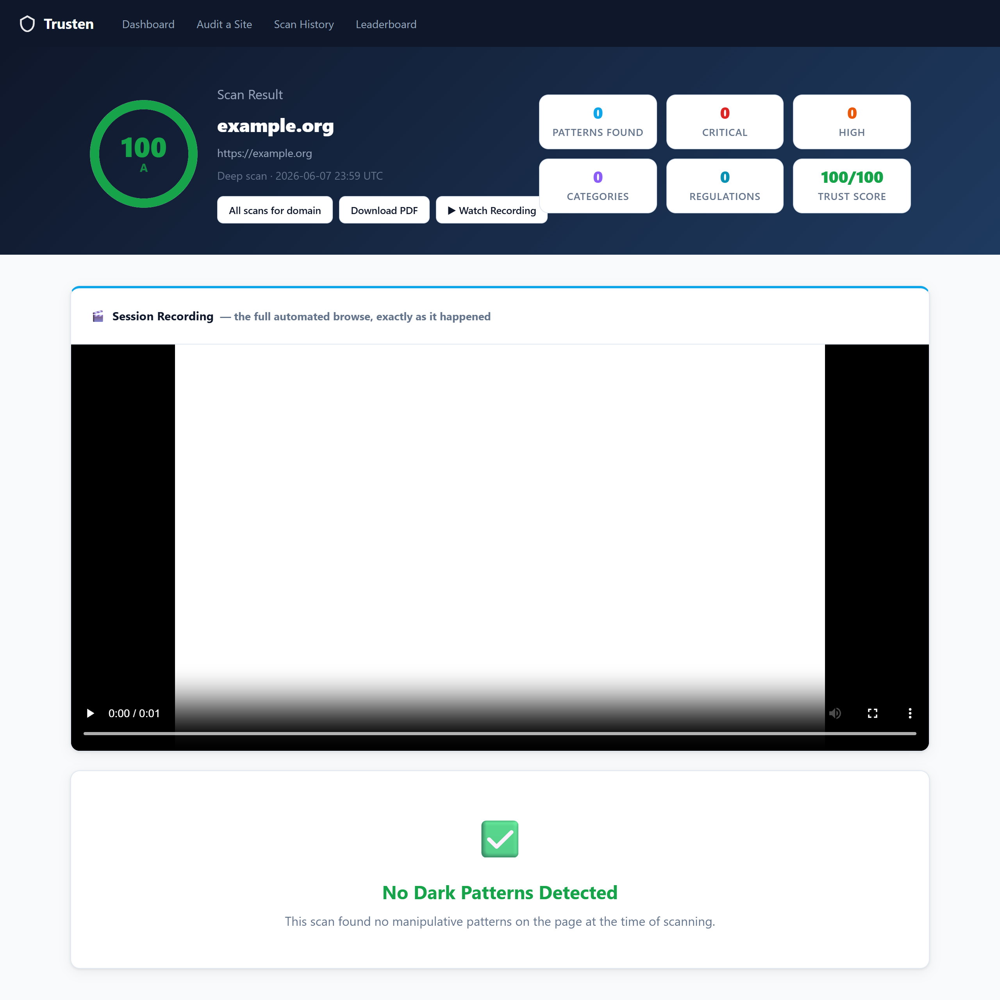

# Trusten

**Dark-pattern detection & consumer-trust auditing.** Trusten scans any website for
manipulative UI/UX ("dark patterns"), grades it on an A–F trust scale, and maps every finding
to the regulations it likely violates — with screenshot, video, and PDF evidence.



> Trusten began as a fork of BrowserOS (an agentic browser) on the assumption that scanning
> needed an in-browser AI agent. It doesn't: scans run on a plain **headless browser**
> (Puppeteer/Chromium). The BrowserOS apparatus has been removed; what remains is a focused
> TypeScript/Bun service.

## What it does

- **Quick Scan** — single-page detection. The browser extension sends the live DOM to the
  server (or the server navigates to a URL headlessly), runs 11 analyzers, and returns a grade
  + findings in seconds.
- **Deep Scan** — multi-step workflow traversal on a headless browser, using **fixed** workflows
  (checkout, signup, cookie consent, pricing, cancellation) or **agentically discovered** ones
  (the agent explores the site and plans tailored journeys, TestSprite-style, falling back to
  the fixed library if the LLM is unavailable). Captures an annotated screenshot per step,
  records a **session video**, and produces an HTML + PDF report. Optionally **watch it live**
  in the dashboard (CDP screencast over WebSocket) with real-time step progress.
- **Quick-scan cache** — a Quick Scan on a page you're browsing merges in cached Deep Scan
  findings for that page, so the richer audit results surface instantly.
- **Scoring** — deterministic A–F grade (100 − weighted severity deductions).
- **Regulatory mapping** — every finding maps to provisions across 14 frameworks (GDPR,
  FTC Act §5, EU DSA, CCPA/CPRA, EU UCPD/CRD, and more).
- **Evidence** — annotated screenshots, **network + cookie capture** (drip pricing, trackers,
  httpOnly cookies), and per-finding regulatory citations.
- **Guardrails** — respects robots.txt and per-domain scan rate limits.
- **Dashboard** — server-rendered UI for scans, history, leaderboard, evidence, and reports.

## Demo

Every finding is paired with visible proof. A scan report shows the trust grade, a severity
breakdown, the detected patterns grouped by category, the offending evidence, and the exact
regulation each pattern violates:



Run a full audit with **fixed or auto-discovered** workflows, and optionally **watch the
headless browser live** while it works:



Deep Scans record a **session video** of the whole automated browse alongside the annotated
per-step screenshots and a downloadable PDF:



## Quick start

Prereqs: [Bun](https://bun.sh) ≥ 1.3.6.

```bash
bun install                              # from the repo root
bunx puppeteer browsers install chrome   # one-time: download Chromium for Puppeteer
bun run start                            # serves http://localhost:9200/trusten
```

Optional — set an LLM key to enable hybrid detection, smarter Deep Scan navigation, and agentic
discovery: `TRUSTEN_LLM_PROVIDER` + `NVIDIA_NIM_API_KEY`, or `TRUSTEN_GEMINI_API_KEY` /
`GEMINI_API_KEY`, or run Ollama locally. Without a key, deterministic detection and the
fixed-workflow fallback still run. See [docs/development.md](docs/development.md).

**Extension:** load `apps/trusten-ext/` unpacked in Chrome (`chrome://extensions` → Developer
mode → Load unpacked) to Quick Scan the page you're viewing.

## Documentation

- [Architecture](docs/architecture.md) — components and the one seam to the browser
- [Scanning](docs/scanning.md) — Quick/Deep Scan, workflows, agentic discovery, watch-live, caching
- [Detection](docs/detection.md) — analyzers, categories, scoring, regulatory mapping
- [API](docs/api.md) — HTTP + WebSocket endpoints
- [Browser extension](docs/extension.md)
- [Development](docs/development.md) — setup, configuration, scripts, conventions

The full product spec lives in `Trusten_PRD.docx`.

## Architecture at a glance

```
apps/
  server/          Trusten API + dashboard + headless scan engine (TS / Bun / Hono / SQLite)
  trusten-ext/     Chrome MV3 extension (Quick Scan popup + on-page highlight overlay)
packages/
  shared/          shared constants/types
```

The single seam to the browser is `apps/server/src/trusten/browser/driver.ts` (`BrowserDriver`),
implemented by `PuppeteerDriver`. (Playwright was the original choice but cannot launch under
Bun — its pipe transport needs inherited fds Bun doesn't provide; Puppeteer's WebSocket
transport works.) See [docs/architecture.md](docs/architecture.md).
